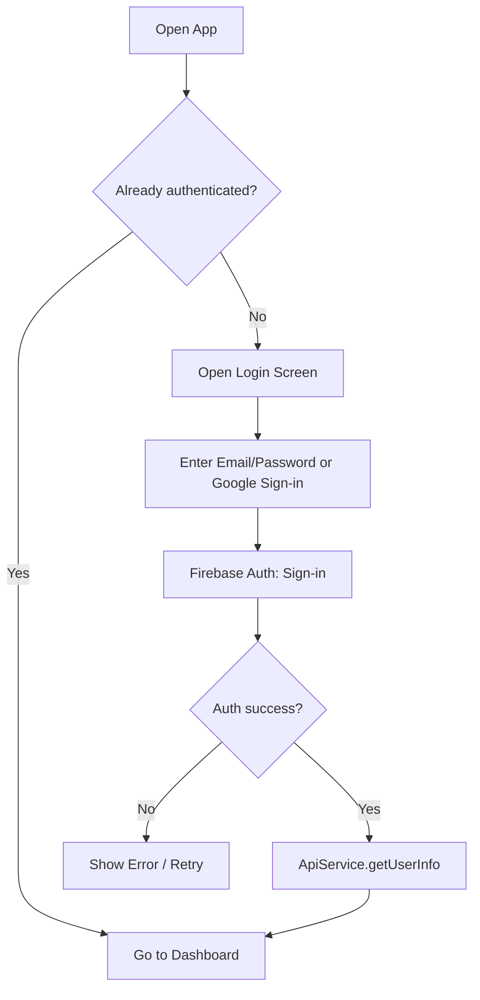
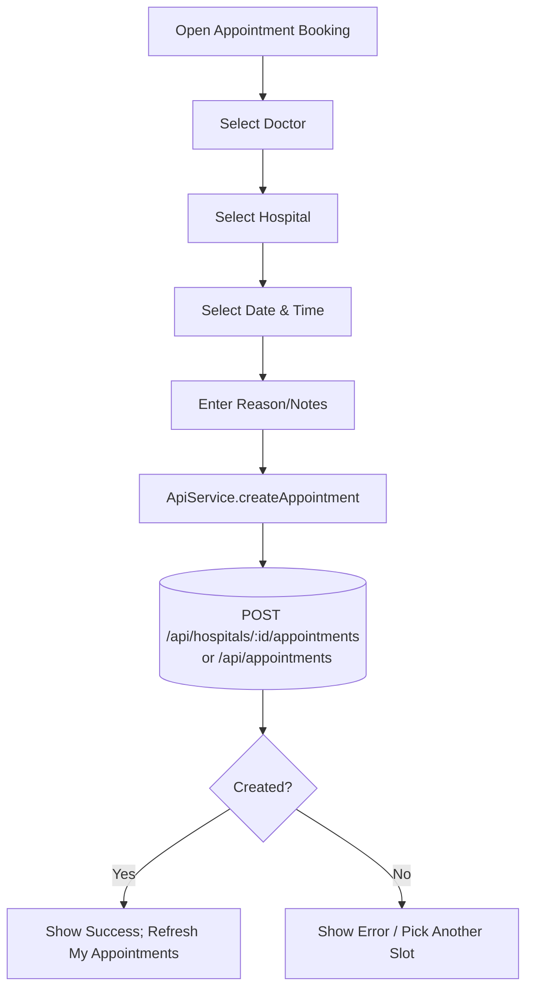
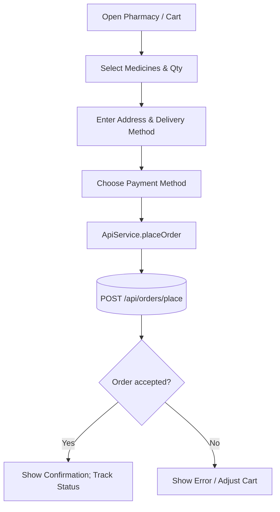
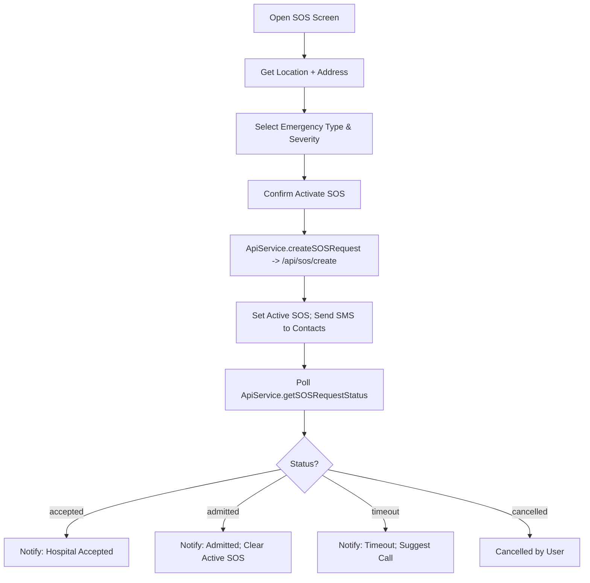

## Activity Diagrams (Key User Flows)

### Combined User Activity (All Main Flows)

```mermaid
flowchart TD
  %% Start
  S((Start)) --> A[Open App]
  A --> B{Authenticated?}
  B -- No --> C[Login/Register]
  C --> C1{Google or Email?}
  C1 -- Google --> C2[Google Sign-in]
  C1 -- Email --> C3[Enter Email/Password]
  C2 --> C4[Session Established]
  C3 --> C4
  C4 --> D[Fetch Profile (ApiService.getUserInfo)]
  B -- Yes --> D

  %% Main menu decisions
  D --> E{Choose Action}
  E -- Book Appointment --> F[Select Doctor]
  E -- Place Order --> O[Open Cart/Pharmacy]
  E -- Emergency SOS --> T[Open SOS Screen]
  E -- View Appointments --> F9[Load My Appointments]
  E -- View Orders --> O9[Load My Orders]

  %% Appointment branch
  F --> G[Select Hospital]
  G --> H[Select Date & Time]
  H --> I[Enter Reason/Notes]
  I --> J[ApiService.createAppointment]
  J --> K[(POST /api/hospitals/:id/appointments or /api/appointments)]
  K --> L{Created?}
  L -- Yes --> M[Show Success]
  M --> F9[Load My Appointments]
  L -- No --> H1[Pick Another Slot]
  H1 --> H

  %% Orders branch
  O --> O1[Select Medicines & Quantities]
  O1 --> O2[Enter Address & Delivery Method]
  O2 --> O3[Choose Payment Method]
  O3 --> O4[ApiService.placeOrder]
  O4 --> O5[(POST /api/orders/place)]
  O5 --> O6{Accepted?}
  O6 -- Yes --> O7[Confirm & Track]
  O7 --> O9[Load My Orders]
  O6 -- No --> O8[Adjust Cart]
  O8 --> O1

  %% SOS branch
  T --> T1[Get Location + Address]
  T1 --> T2[Select Emergency Type & Severity]
  T2 --> T3[Confirm Activate SOS]
  T3 --> T4[ApiService.createSOSRequest -> /api/sos/create]
  T4 --> T5[Set Active SOS; Send SMS]
  T5 --> T6[Poll getSOSRequestStatus]
  T6 --> T7{Status?}
  T7 -- accepted --> T8[Notify Acceptance]
  T7 -- admitted --> T9[Notify Admitted; Clear Active]
  T7 -- timeout --> T10[Notify Timeout]
  T7 -- cancelled --> T11[Cancelled]

  %% Viewing lists
  F9 --> E
  O9 --> E

  %% End
  T8 --> E
  T9 --> E
  T10 --> E
  T11 --> E
```

Open in a Markdown preview that supports Mermaid to view the diagrams.

### 1) User Login



### 2) Registration (Patient)

```mermaid
flowchart TD
  A[Open Registration Screen] --> B[Fill Personal Details]
  B --> C{Google user?}
  C -- Yes --> D[Use current Firebase session]
  C -- No --> E[Create Email/Password in Firebase]
  D --> F[RegistrationService.registerUser -> /api/users]
  E --> F
  F --> G{Backend success?}
  G -- Yes --> H[Persist User (Arc ID/QR) in Mongo]
  H --> I[Navigate to Dashboard]
  G -- No --> J[Show Error / Retry]
```

### 3) Book Appointment



### 4) Place Pharmacy Order



### 5) Emergency SOS




