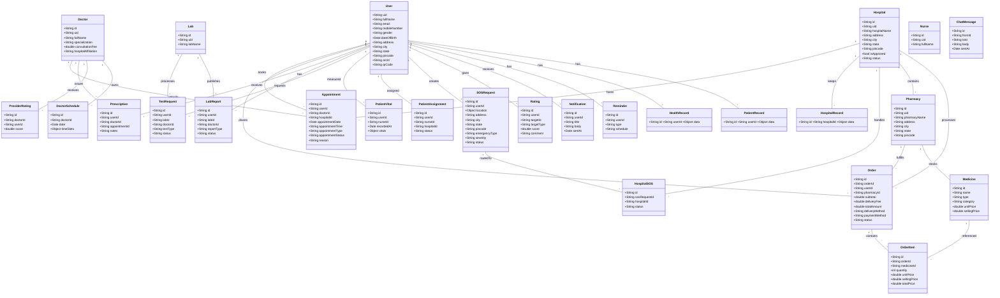

## Class Diagram (Core Domain)

Open in a Markdown preview that supports Mermaid to view the diagram.

```mermaid
classDiagram
  class User {
    +String uid
    +String fullName
    +String email
    +String mobileNumber
    +String gender
    +Date   dateOfBirth
    +String address
    +String city
    +String state
    +String pincode
    +String arcId
    +String qrCode
  }

  class Doctor {
    +String id
    +String uid
    +String fullName
    +String specialization
    +double consultationFee
    +String hospitalAffiliation
  }

  class Hospital {
    +String id
    +String uid
    +String hospitalName
    +String address
    +String city
    +String state
    +String pincode
    +bool isApproved
    +String status
  }

  class Pharmacy {
    +String id
    +String uid
    +String pharmacyName
    +String address
    +String city
    +String state
    +String pincode
  }

  class Medicine {
    +String id
    +String name
    +String type
    +String category
    +double unitPrice
    +double sellingPrice
  }

  class Order {
    +String id
    +String orderId
    +String userId
    +String pharmacyId
    +double subtotal
    +double deliveryFee
    +double totalAmount
    +String deliveryMethod
    +String paymentMethod
    +String status
  }

  class OrderItem {
    +String id
    +String orderId
    +String medicineId
    +int quantity
    +double unitPrice
    +double sellingPrice
    +double totalPrice
  }

  class Appointment {
    +String id
    +String userId
    +String doctorId
    +String hospitalId
    +Date   appointmentDate
    +String appointmentTime
    +String appointmentType
    +String appointmentStatus
    +String reason
  }

  class Prescription {
    +String id
    +String userId
    +String doctorId
    +String appointmentId
    +String notes
  }

  class DoctorSchedule {
    +String id
    +String doctorId
    +Date   date
    +Object timeSlots
  }

  class Lab {
    +String id
    +String uid
    +String labName
  }

  class TestRequest {
    +String id
    +String userId
    +String labId
    +String doctorId
    +String testType
    +String status
  }

  class LabReport {
    +String id
    +String userId
    +String labId
    +String doctorId
    +String reportType
    +String status
  }

  class Nurse {
    +String id
    +String uid
    +String fullName
  }

  class PatientAssignment {
    +String id
    +String userId
    +String nurseId
    +String hospitalId
    +String status
  }

  class PatientVital {
    +String id
    +String userId
    +String nurseId
    +Date   recordedAt
    +Object vitals
  }

  class ChatMessage {
    +String id
    +String fromId
    +String toId
    +String body
    +Date   sentAt
  }

  class SOSRequest {
    +String id
    +String userId
    +Object location
    +String address
    +String city
    +String state
    +String pincode
    +String emergencyType
    +String severity
    +String status
  }

  class HospitalSOS {
    +String id
    +String sosRequestId
    +String hospitalId
    +String status
  }

  class Rating {
    +String id
    +String userId
    +String targetId
    +String targetType
    +double score
    +String comment
  }

  class ProviderRating {
    +String id
    +String doctorId
    +String userId
    +double score
  }

  class Notification {
    +String id
    +String userId
    +String title
    +String body
    +Date   sentAt
  }

  class Reminder {
    +String id
    +String userId
    +String type
    +String schedule
  }

  class HealthRecord { +String id +String userId +Object data }
  class PatientRecord { +String id +String userId +Object data }
  class HospitalRecord { +String id +String hospitalId +Object data }

  %% Relationships
  User "1" -- "*" Appointment : books
  User "1" -- "*" Order : places
  User "1" -- "*" Prescription : receives
  User "1" -- "*" LabReport : has
  User "1" -- "*" TestRequest : requests
  User "1" -- "*" PatientVital : measured
  User "1" -- "*" PatientAssignment : assigned
  User "1" -- "*" SOSRequest : creates
  User "1" -- "*" Rating : gives
  User "1" -- "*" Notification : receives
  User "1" -- "*" Reminder : has
  User "1" -- "*" HealthRecord : has
  User "1" -- "*" PatientRecord : has

  Doctor "1" -- "*" Appointment : attends
  Doctor "1" -- "*" Prescription : issues
  Doctor "1" -- "*" ProviderRating : receives
  Doctor "1" -- "*" DoctorSchedule : owns

  Hospital "1" -- "*" Appointment : hosts
  Hospital "1" -- "*" HospitalRecord : keeps
  Hospital "1" -- "*" HospitalSOS : handles
  Hospital "1" -- "*" Pharmacy : contains
  Hospital "1" -- "*" Order : processes

  Pharmacy "1" -- "*" Order : fulfills
  Pharmacy "1" -- "*" Medicine : stocks

  Order "1" -- "*" OrderItem : contains
  Medicine "1" -- "*" OrderItem : referenced

  Lab "1" -- "*" TestRequest : processes
  Lab "1" -- "*" LabReport : publishes

  SOSRequest "1" -- "*" HospitalSOS : routedTo
```

