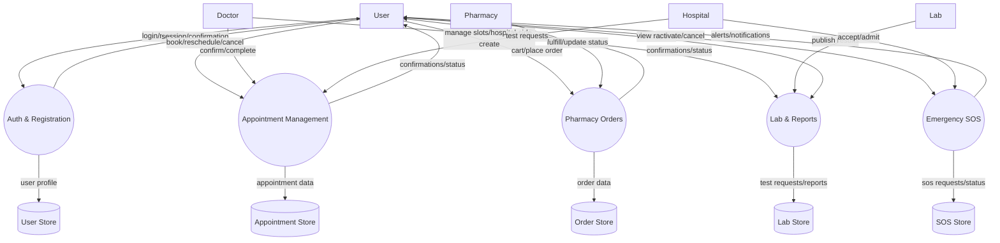

## Data Flow Diagrams

This file contains DFD Level 0 (context) and Level 1 (major processes) for the Arcular Plus system, using Mermaid.

### Level 0 – Context Diagram

```mermaid
flowchart LR
  %% External entities
  U[User (Patient)]
  D[Doctor]
  H[Hospital]
  P[Pharmacy]
  L[Lab]
  N[Nurse]
  A[Admin]

  %% System
  S((Arcular Plus System))

  %% Flows in/out
  U -- Auth, Appointments, Orders, SOS, Records --> S
  D -- Appointments, Prescriptions, Schedule --> S
  H -- Appointments, SOS Accept/Admit, Records --> S
  P -- Inventory, Orders Fulfillment --> S
  L -- Test Requests, Lab Reports --> S
  N -- Assignments, Vitals --> S
  A -- Approvals, Admin Ops --> S

  S -- Notifications, Confirmations, Results --> U
  S -- Schedules, Tasks --> D
  S -- Tasks, Admissions --> H
  S -- Orders, Inventory Updates --> P
  S -- Test Orders, Results --> L
  S -- Assignments, Alerts --> N
  S -- Reports, Dashboards --> A
```

### Level 1 – Major Processes



Notes:
- Data stores are logical; actual persistence uses MongoDB models shown in the ER diagram.
- Add Level 2 diagrams per process on request (e.g., detailed booking flow).


