## Entity Relationship Diagram (Backend Core)

```mermaid
erDiagram
  USER ||--o{ APPOINTMENT : books
  USER ||--o{ ORDER : places
  USER ||--o{ PRESCRIPTION : receives
  USER ||--o{ LABREPORT : has
  USER ||--o{ TESTREQUEST : requests
  USER ||--o{ PATIENTVITAL : measured
  USER ||--o{ PATIENTASSIGNMENT : assigned
  USER ||--o{ SOSREQUEST : creates
  USER ||--o{ RATING : gives
  USER ||--o{ NOTIFICATION : receives
  USER ||--o{ REMINDER : has
  USER ||--o{ HEALTHRECORD : has
  USER ||--o{ PATIENTRECORD : has

  DOCTOR ||--o{ APPOINTMENT : attends
  DOCTOR ||--o{ PRESCRIPTION : issues
  DOCTOR ||--o{ RATING : receives
  DOCTOR ||--o{ DOCTORSCHEDULE : owns

  HOSPITAL ||--o{ APPOINTMENT : hosts
  HOSPITAL ||--o{ HOSPITALRECORD : keeps
  HOSPITAL ||--o{ HOSPITALSOS : handles
  HOSPITAL ||--o{ PHARMACY : contains
  HOSPITAL ||--o{ ORDER : processes

  PHARMACY ||--o{ ORDER : fulfills
  PHARMACY ||--o{ MEDICINE : stocks

  ORDER ||--o{ ORDERITEM : contains
  MEDICINE ||--o{ ORDERITEM : referenced

  LAB ||--o{ TESTREQUEST : processes
  LAB ||--o{ LABREPORT : publishes

  NURSE ||--o{ PATIENTASSIGNMENT : manages
  NURSE ||--o{ PATIENTVITAL : records

  CHATMESSAGE }o--|| USER : fromOrTo
  CHATMESSAGE }o--|| DOCTOR : fromOrTo
  CHATMESSAGE }o--|| NURSE : fromOrTo

  SOSREQUEST ||--o{ HOSPITALSOS : routedTo
  SOSREQUEST ||--o{ NOTIFICATION : triggers

  PROVIDERRATING ||--|| RATING : specializes

  MENSTRUALCYCLE ||--|| REMINDER : schedules
  PREGNANCYTRACKING ||--|| REMINDER : schedules

  USER {
    string uid PK
    string fullName
    string email
    string mobileNumber
    string gender
    date   dateOfBirth
    string address
    string city
    string state
    string pincode
    string arcId
    string qrCode
  }

  DOCTOR {
    string id PK
    string uid
    string fullName
    string specialization
    number consultationFee
    string hospitalAffiliation
  }

  HOSPITAL {
    string id PK
    string uid
    string hospitalName
    string address
    string city
    string state
    string pincode
    boolean isApproved
    string status
  }

  PHARMACY {
    string id PK
    string uid
    string pharmacyName
    string address
    string city
    string state
    string pincode
  }

  MEDICINE {
    string id PK
    string name
    string type
    string category
    number unitPrice
    number sellingPrice
  }

  ORDER {
    string id PK
    string orderId
    string userId FK
    string pharmacyId FK
    number subtotal
    number deliveryFee
    number totalAmount
    string deliveryMethod
    string paymentMethod
    string status
  }

  ORDERITEM {
    string id PK
    string orderId FK
    string medicineId FK
    number quantity
    number unitPrice
    number sellingPrice
    number totalPrice
  }

  APPOINTMENT {
    string id PK
    string userId FK
    string doctorId FK
    string hospitalId FK
    date   appointmentDate
    string appointmentTime
    string appointmentType
    string appointmentStatus
    string reason
  }

  PRESCRIPTION {
    string id PK
    string userId FK
    string doctorId FK
    string appointmentId FK
    string notes
  }

  DOCTORSCHEDULE {
    string id PK
    string doctorId FK
    date   date
    json   timeSlots
  }

  TESTREQUEST {
    string id PK
    string userId FK
    string labId FK
    string doctorId FK
    string testType
    string status
  }

  LABREPORT {
    string id PK
    string userId FK
    string labId FK
    string doctorId FK
    string reportType
    string status
  }

  PATIENTASSIGNMENT {
    string id PK
    string userId FK
    string nurseId FK
    string hospitalId FK
    string status
  }

  PATIENTVITAL {
    string id PK
    string userId FK
    string nurseId FK
    date   recordedAt
    json   vitals
  }

  NURSE {
    string id PK
    string uid
    string fullName
  }

  CHATMESSAGE {
    string id PK
    string fromId
    string toId
    string body
    date   sentAt
  }

  SOSREQUEST {
    string id PK
    string userId FK
    json   location
    string address
    string city
    string state
    string pincode
    string emergencyType
    string severity
    string status
  }

  HOSPITALSOS {
    string id PK
    string sosRequestId FK
    string hospitalId FK
    string status
  }

  RATING {
    string id PK
    string userId FK
    string targetId
    string targetType
    number score
    string comment
  }

  PROVIDERRATING {
    string id PK
    string doctorId FK
    string userId FK
    number score
  }

  REMINDER {
    string id PK
    string userId FK
    string type
    string schedule
  }

  NOTIFICATION {
    string id PK
    string userId FK
    string title
    string body
    date   sentAt
  }

  HEALTHRECORD {
    string id PK
    string userId FK
    json   data
  }

  PATIENTRECORD {
    string id PK
    string userId FK
    json   data
  }

  HOSPITALRECORD {
    string id PK
    string hospitalId FK
    json   data
  }

  MENSTRUALCYCLE {
    string id PK
    string userId FK
    date   lastPeriod
    number cycleLength
  }

  PREGNANCYTRACKING {
    string id PK
    string userId FK
    date   dueDate
    json   milestones
  }
```



Notes:
- PK/FK indicate logical keys; actual MongoDB `_id` fields are ObjectIds.
- Relationships reflect controller logic inferred from routes and service calls.

---

## User‑Centric Combined ER (All Roles)

```mermaid
erDiagram
  USER ||--o{ APPOINTMENT : books
  USER ||--o{ ORDER : places
  USER ||--o{ PRESCRIPTION : receives
  USER ||--o{ LABREPORT : has
  USER ||--o{ TESTREQUEST : requests
  USER ||--o{ PATIENTVITAL : measured
  USER ||--o{ PATIENTASSIGNMENT : assigned
  USER ||--o{ SOSREQUEST : creates
  USER ||--o{ RATING : gives
  USER ||--o{ NOTIFICATION : receives
  USER ||--o{ REMINDER : has
  USER ||--o{ HEALTHRECORD : has
  USER ||--o{ PATIENTRECORD : has

  DOCTOR ||--o{ APPOINTMENT : attends
  DOCTOR ||--o{ PRESCRIPTION : issues
  DOCTOR ||--o{ RATING : receives
  DOCTOR ||--o{ DOCTORSCHEDULE : owns

  NURSE ||--o{ PATIENTASSIGNMENT : manages
  NURSE ||--o{ PATIENTVITAL : records

  HOSPITAL ||--o{ APPOINTMENT : hosts
  HOSPITAL ||--o{ HOSPITALRECORD : keeps
  HOSPITAL ||--o{ HOSPITALSOS : handles
  HOSPITAL ||--o{ PHARMACY : contains
  HOSPITAL ||--o{ ORDER : processes

  PHARMACY ||--o{ ORDER : fulfills
  PHARMACY ||--o{ MEDICINE : stocks

  ORDER ||--o{ ORDERITEM : contains
  MEDICINE ||--o{ ORDERITEM : referenced

  LAB ||--o{ TESTREQUEST : processes
  LAB ||--o{ LABREPORT : publishes

  SOSREQUEST ||--o{ HOSPITALSOS : routedTo

  CHATMESSAGE }o--|| USER : fromOrTo
  CHATMESSAGE }o--|| DOCTOR : fromOrTo
  CHATMESSAGE }o--|| NURSE : fromOrTo

  USER {
    string uid PK
    string fullName
    string email
    string mobileNumber
    string arcId
  }
  DOCTOR { string id PK; string uid; string specialization }
  NURSE  { string id PK; string uid }
  HOSPITAL { string id PK; string uid; string hospitalName }
  PHARMACY { string id PK; string uid; string pharmacyName }
  LAB { string id PK; string uid; string labName }
  APPOINTMENT { string id PK; string userId FK; string doctorId FK; string hospitalId FK; date appointmentDate; string appointmentTime; string status }
  PRESCRIPTION { string id PK; string userId FK; string doctorId FK; string appointmentId FK }
  DOCTORSCHEDULE { string id PK; string doctorId FK; date date; json timeSlots }
  ORDER { string id PK; string userId FK; string pharmacyId FK; number totalAmount; string status }
  ORDERITEM { string id PK; string orderId FK; string medicineId FK; number quantity }
  MEDICINE { string id PK; string name; number sellingPrice }
  TESTREQUEST { string id PK; string userId FK; string labId FK; string status }
  LABREPORT { string id PK; string userId FK; string labId FK; string status }
  PATIENTASSIGNMENT { string id PK; string userId FK; string nurseId FK; string hospitalId FK; string status }
  PATIENTVITAL { string id PK; string userId FK; string nurseId FK; date recordedAt }
  SOSREQUEST { string id PK; string userId FK; string status }
  HOSPITALSOS { string id PK; string sosRequestId FK; string hospitalId FK; string status }
  RATING { string id PK; string userId FK; string targetId; string targetType; number score }
  NOTIFICATION { string id PK; string userId FK; string title; date sentAt }
  REMINDER { string id PK; string userId FK; string type; string schedule }
  HEALTHRECORD { string id PK; string userId FK }
  PATIENTRECORD { string id PK; string userId FK }
  HOSPITALRECORD { string id PK; string hospitalId FK }
```

Guidance:
- This consolidated view centers the `USER` and shows how each role/entity links to user activities and records.
- Use this as the base schema map across all patient/user interactions.


