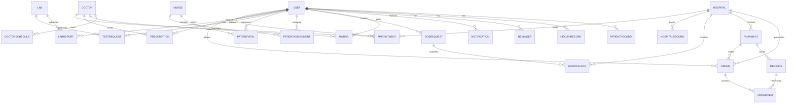

## Visual ER Diagram (User + All Roles)

Open this file in a Markdown preview that supports Mermaid to view the diagram.

```mermaid
erDiagram
  USER ||--o{ APPOINTMENT : books
  USER ||--o{ ORDER : places
  USER ||--o{ PRESCRIPTION : receives
  USER ||--o{ LABREPORT : has
  USER ||--o{ TESTREQUEST : requests
  USER ||--o{ PATIENTVITAL : measured
  USER ||--o{ PATIENTASSIGNMENT : assigned
  USER ||--o{ SOSREQUEST : creates
  USER ||--o{ RATING : gives
  USER ||--o{ NOTIFICATION : receives
  USER ||--o{ REMINDER : has
  USER ||--o{ HEALTHRECORD : has
  USER ||--o{ PATIENTRECORD : has

  DOCTOR ||--o{ APPOINTMENT : attends
  DOCTOR ||--o{ PRESCRIPTION : issues
  DOCTOR ||--o{ RATING : receives
  DOCTOR ||--o{ DOCTORSCHEDULE : owns

  NURSE ||--o{ PATIENTASSIGNMENT : manages
  NURSE ||--o{ PATIENTVITAL : records

  HOSPITAL ||--o{ APPOINTMENT : hosts
  HOSPITAL ||--o{ HOSPITALRECORD : keeps
  HOSPITAL ||--o{ HOSPITALSOS : handles
  HOSPITAL ||--o{ PHARMACY : contains
  HOSPITAL ||--o{ ORDER : processes

  PHARMACY ||--o{ ORDER : fulfills
  PHARMACY ||--o{ MEDICINE : stocks

  ORDER ||--o{ ORDERITEM : contains
  MEDICINE ||--o{ ORDERITEM : referenced

  LAB ||--o{ TESTREQUEST : processes
  LAB ||--o{ LABREPORT : publishes

  SOSREQUEST ||--o{ HOSPITALSOS : routedTo
```

