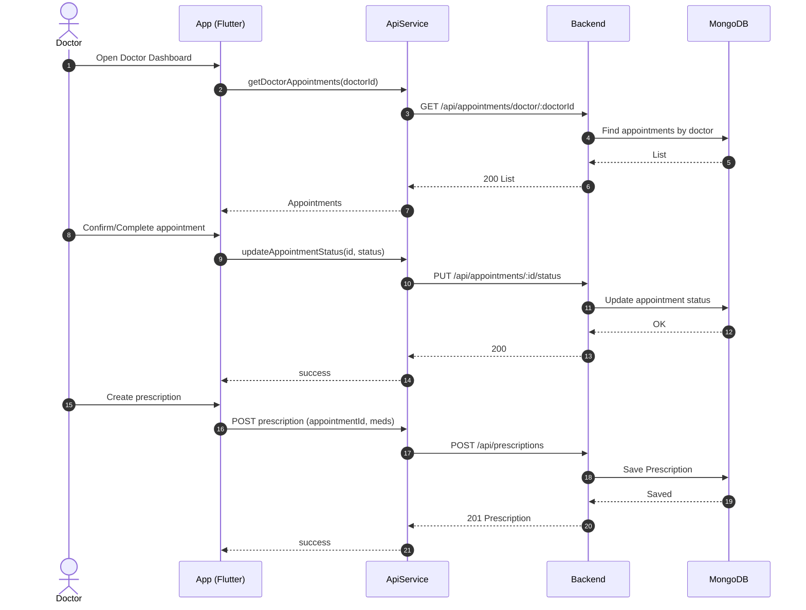
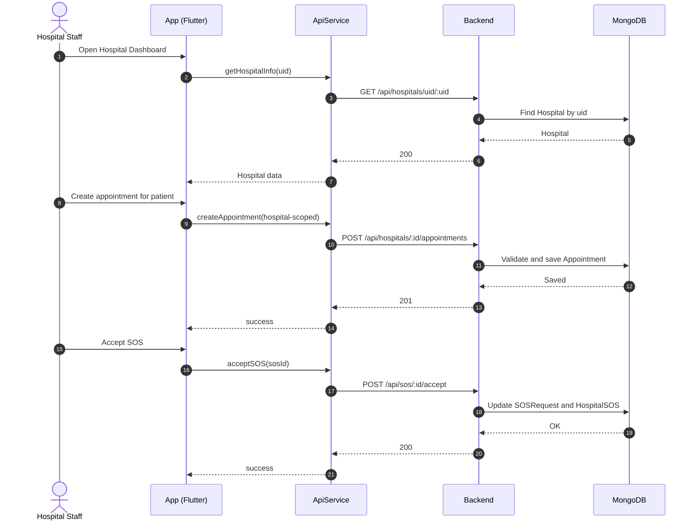
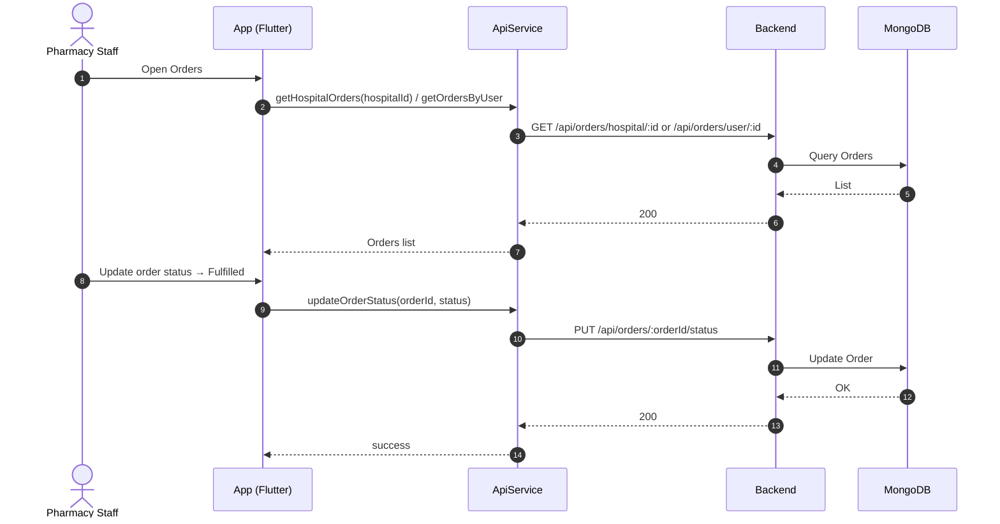
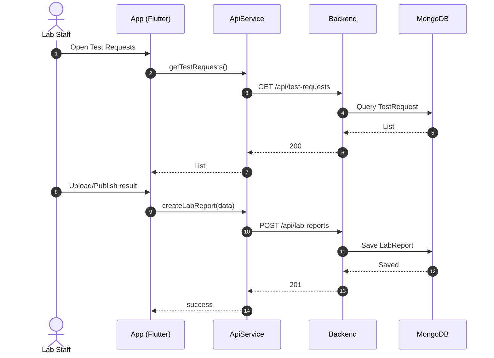
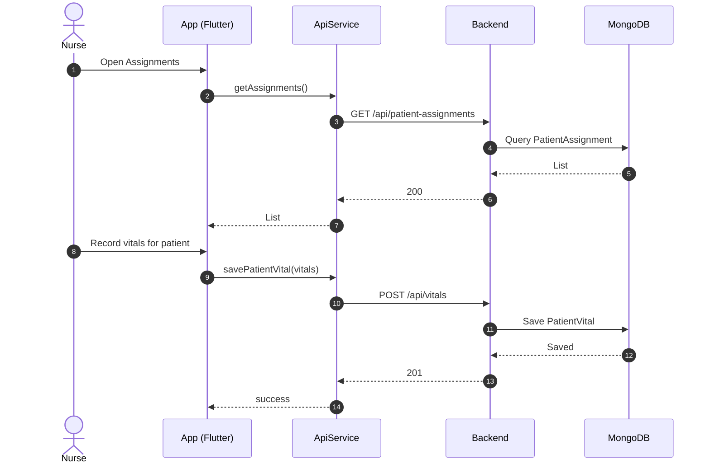
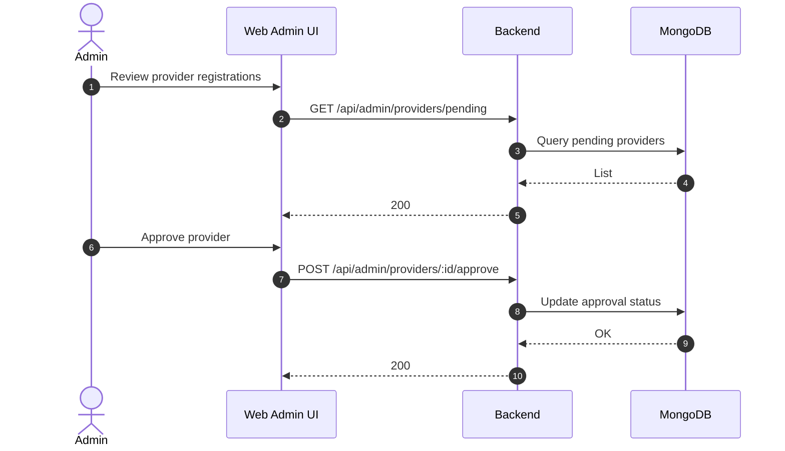

## Combined User Sequence Diagram

Open in a Markdown preview that supports Mermaid to view the diagram.

```mermaid
sequenceDiagram
  autonumber
  actor U as User (Patient)
  participant A as App (Flutter)
  participant S as ApiService
  participant B as Backend (Express)
  participant F as Firebase Auth
  participant M as MongoDB (Models)
  participant H as Hospital
  participant P as Pharmacy

  rect rgb(245,245,245)
  note over U,A: Login / Registration
  U->>A: Open app
  A->>F: Check session
  alt Not authenticated
    U->>A: Login (Email/Google) or Register
    A->>F: Sign-in / Create user
    F-->>A: ID Token
    A->>S: getUserInfo(uid)
    S->>B: GET /api/users/:uid (Bearer ID Token)
    B->>M: Find User by uid
    M-->>B: User
    B-->>S: 200 User
    S-->>A: UserModel
  else Authenticated
    A->>S: getUserInfo(uid)
    S->>B: GET /api/users/:uid
    B->>M: Find User by uid
    M-->>B: User
    B-->>S: 200 User
    S-->>A: UserModel
  end
  A-->>U: Show Dashboard
  end

  rect rgb(245,255,245)
  note over U,A: Book Appointment
  U->>A: Select doctor, hospital, slot
  A->>S: createAppointment(data)
  alt Hospital-scoped route
    S->>B: POST /api/hospitals/:id/appointments
  else Generic route
    S->>B: POST /api/appointments
  end
  B->>M: Validate user/doctor/hospital, check slot
  M-->>B: OK / Conflict
  alt Created
    B-->>S: 201 Appointment
    S-->>A: success
    A-->>U: Success + refresh My Appointments
  else Slot conflict
    B-->>S: 400 Conflict
    S-->>A: error
    A-->>U: Pick another slot
  end
  end

  rect rgb(245,245,255)
  note over U,A: Place Pharmacy Order
  U->>A: Add medicines, address, payment
  A->>S: placeOrder(userId, items, ...)
  S->>B: POST /api/orders/place (Bearer)
  B->>M: Fetch User, Pharmacy, compute totals
  M-->>B: OK
  alt Accepted
    B-->>S: 201 Order
    S-->>A: success
    A-->>U: Show confirmation & tracking
  else Failed
    B-->>S: 4xx/5xx
    S-->>A: error
    A-->>U: Adjust cart / retry
  end
  end

  rect rgb(255,245,245)
  note over U,A: Emergency SOS
  U->>A: Open SOS, select type/severity
  A->>S: createSOSRequest(payload)
  S->>B: POST /api/sos/create (Bearer)
  B->>M: Persist SOSRequest, locate nearby hospitals
  M-->>B: Saved + candidates
  B-->>S: 201 {sosRequestId, status, timeoutAt}
  S-->>A: success
  A-->>U: SOS active; send SMS; start polling
  loop Poll status
    A->>S: getSOSRequestStatus(id)
    S->>B: GET /api/sos/:id/status
    B->>M: Read SOSRequest
    M-->>B: status
    B-->>S: 200 status
    S-->>A: status
  end
  alt accepted
    A-->>U: Hospital accepted
  else admitted
    A-->>U: Admitted; clear active SOS
  else timeout
    A-->>U: Timeout; suggest call
  else cancelled
    A-->>U: Cancelled
  end
  end
```


---

## Doctor Sequence (Confirm Appointment, Create Prescription)



## Hospital Sequence (Profile, Hospital-side Appointment, SOS Acceptance)



## Pharmacy Sequence (Fulfill Order)



## Lab Sequence (Publish Lab Report)



## Nurse Sequence (Record Vitals)



## Admin Sequence (Approve Provider)



